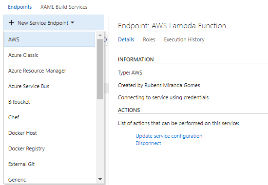
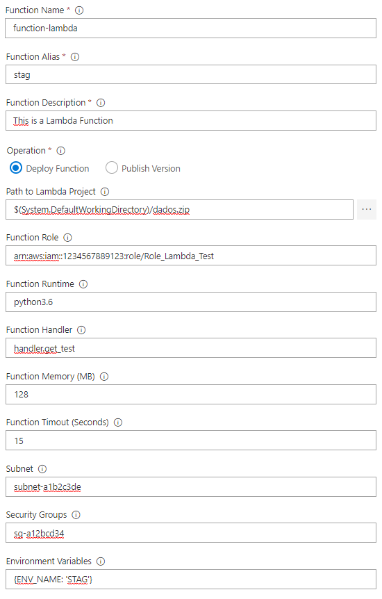
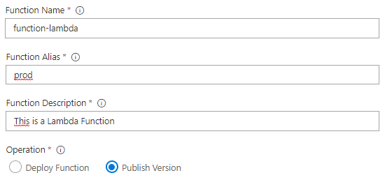

# Overview

The AWS Lambda Deployment adds a task to easily enable build or release pipelines in VSTS to work with AWS Lambda Functions. [It is free and open source plugin](https://github.com/zapimoveis/vsts-task-lambda-deploy)!

The task include a new service endpoint type *AWS*, to supply AWS credentials to the tasks at runtime (If you have the AWS Tools for Microsoft Visual Studio Team Services (VSTS) plugin installed, you can use the already configured endpoints).

## Highlighted Features

### Create an AWS Credentials Connection

To work with AWS Lambda services an AWS subscription has to be linked to Visual Studio Team Services using the Services tab in the Account Administration section. Add the AWS subscription to use in the Build or Release Management definition by opening the Account Administration screen (gear icon on the top-right of the screen) and then click on the Services Tab.

Select the *AWS* endpoint type and provide the following paramters

- A name used to refer to the credentials when configuring tasks that require AWS credentials (Like)
- AWS Access Key ID
- AWS Secret Access Key

The AWS Lambda subscription needs some extra grant to use all features of plugin
- IAM:
    - iam:PassRole 
- VPC:
    - ec2:CreateNetworkInterface
    - ec2:DescribeNetworkInterfaces
    - ec2:DeleteNetworkInterface

Please refer to [About Access Keys](https://aws.amazon.com/developers/access-keys/). Note that we strongly suggest the use of access and secret keys generated for an Identity and Access Management (IAM) user account.

### Deploy Serveless Applications
Create or update a Lambda Function. This mode only modifies the last version of the function ($LATEST). You can set an alias to invoke this version.

### Publish a Version
Publish a new version of the Lambda Function, based on the state of the latest version ($LATEST). You can set an alias to invoke this version.

Please refer to [Lambda Versioning and Aliases](http://docs.aws.amazon.com/pt_br/lambda/latest/dg/versioning-aliases.html) for more information.

### Reporting issues
Check out the [Github issues](https://github.com/zapimoveis/vsts-task-lambda-deploy/issues) directly.

## Minimum supported environments
- Visual Studio Team Services
